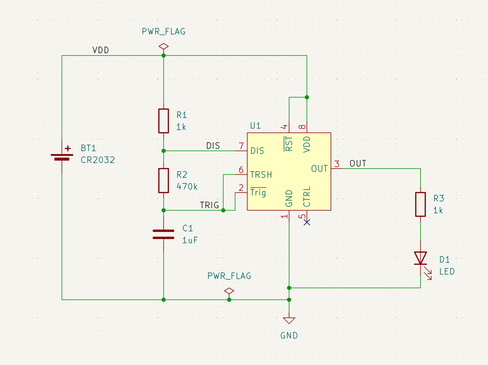
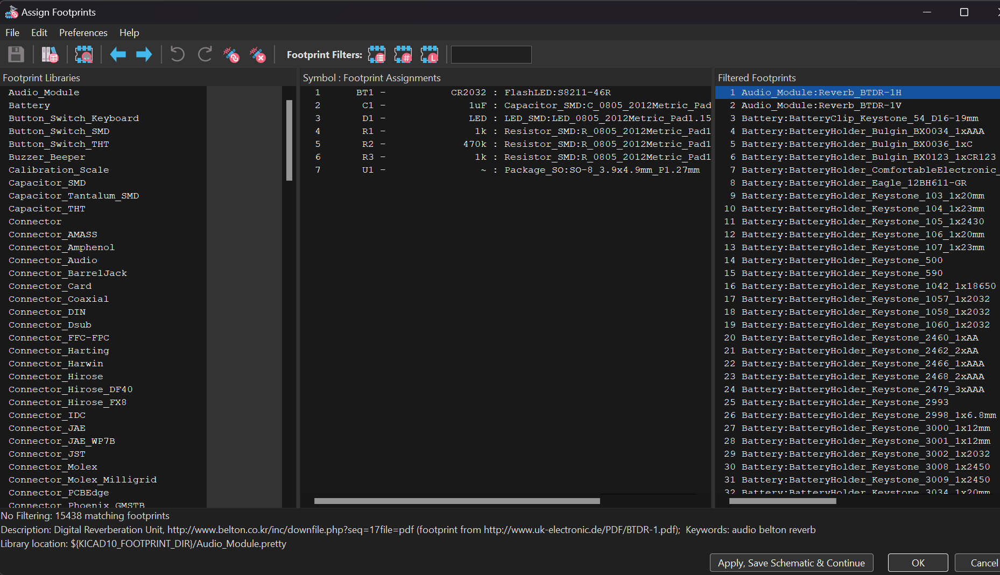
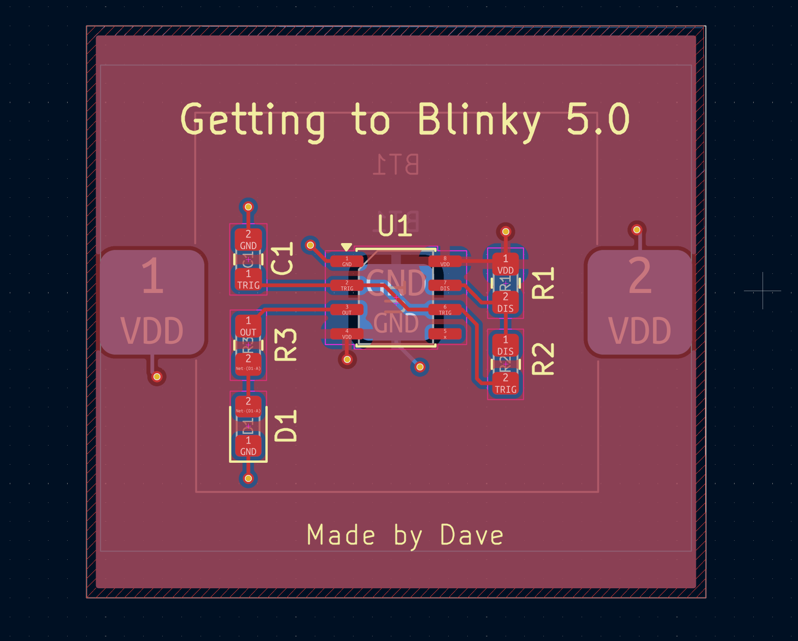
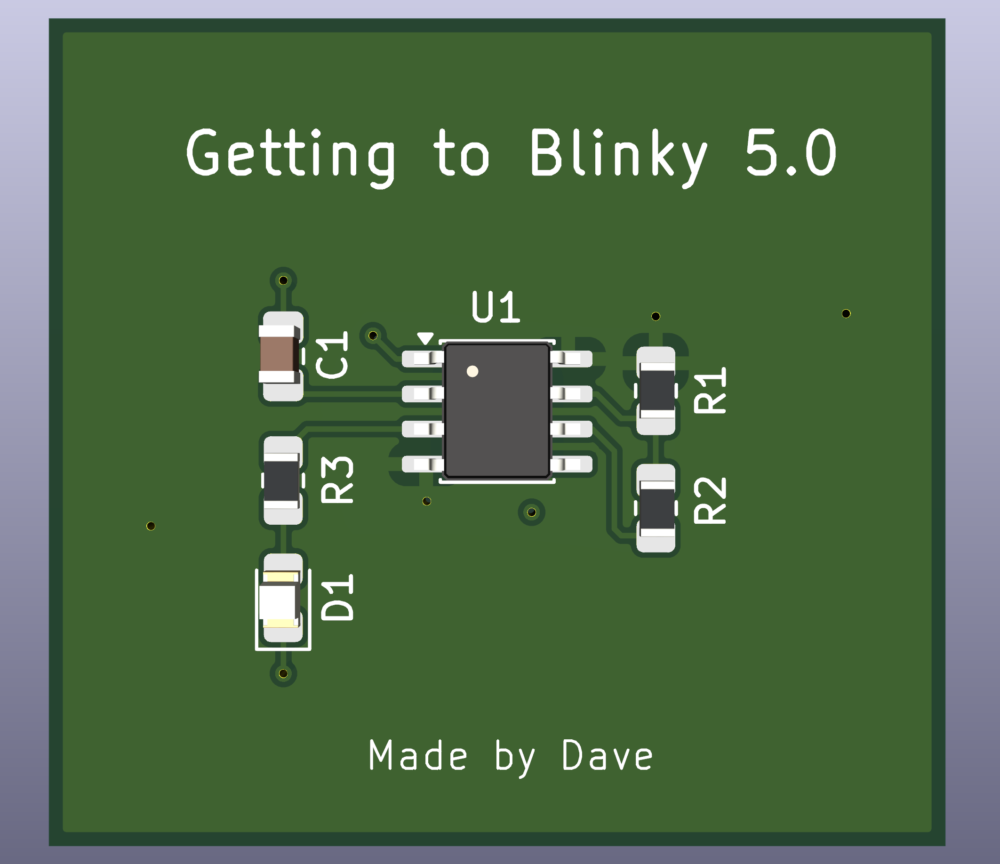
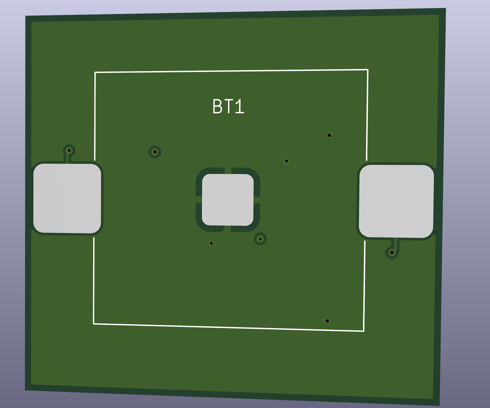

# Getting to Blinky 5.0

A two-layer PCB designed in KiCad featuring a 7555 CMOS timer astable oscillator circuit that blinks an LED. Built as a hands-on learning project to develop familiarity with KiCad schematic capture, footprint assignment, PCB layout, and DRC workflow.

---

## Circuit Overview

The circuit uses a 7555 timer (U1) configured in **astable mode** to generate a continuous square wave output that drives an LED.

| Ref | Part | Value | Description |
|-----|------|-------|-------------|
| U1 | 7555 Timer | - | SO-8 SMD package, custom schematic symbol |
| BT1 | CR2032 | 3V | Coin cell battery, custom PCB footprint |
| R1 | Resistor | 1k ohm | Timing resistor (charge path) |
| R2 | Resistor | 470k ohm | Timing resistor (discharge path) |
| R3 | Resistor | 1k ohm | LED current limiting resistor |
| C1 | Capacitor | 1uF | Timing capacitor |
| D1 | LED | - | Output indicator, 0805 SMD |

### How It Works

The 7555 timer alternately charges and discharges C1 through R1 and R2, producing a square wave on the OUT pin (pin 3). R3 limits current through D1. The blink frequency is approximately:

```
f = 1.44 / ((R1 + 2*R2) * C1)
f = 1.44 / ((1k + 2*470k) * 1uF) = 1.53 Hz
```

---

## PCB Details

- **Tool:** KiCad 8
- **Layers:** 2-layer board
- **Power supply:** CR2032 coin cell (3V)
- **Trace width:** 0.2mm for improved manufacturability
- **Copper pours:** GND pour on B.Cu, VDD pour on F.Cu
- **Package sizes:** All passives in 0805 for hand solderability

### Custom Work

- **Custom schematic symbol** created for the 7555 timer (U1)
- **Custom PCB footprint** created for the CR2032 coin cell holder (BT1)

### DRC Results

| Category | Count |
|----------|-------|
| Errors | 0 |
| Warnings | 4 |
| Unconnected Items | 0 |

The 4 warnings are non-critical: 3 are single-layer via warnings resolved after copper pour fill, and 1 is a footprint-library mismatch on BT1 due to the custom footprint.

---

## Board Images

### Schematic


### Assigning Footprints



### PCB Layout


### 3D Render - Top


### 3D Render - Bottom


---

## Key Learnings

- KiCad schematic capture and ERC workflow
- Creating custom schematic symbols and PCB footprints
- 7555 CMOS timer astable configuration and timing calculations
- Two-layer PCB layout with copper pour fills
- DRC execution and warning triage
- Silkscreen labeling and board branding

---

## Author

**Dave** - Electrical Engineering, Stevens Institute of Technology  
PCB design portfolio project | KiCad | June 2026
